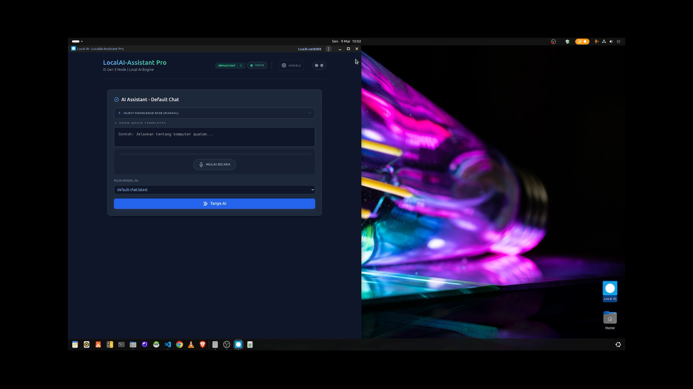

# local-ai

## Youtube Video
[](https://youtu.be/2Gi_UE_VnZI)

# Build with PHP-8 & Ollama

Stacks:
- PHP-8.x & SQLite
- Ollama
- AI Models (gemma3:1b, qwen2.5:0.5b, embeddinggemma);
- HTMX, AlpineJS, Tailwind-CSS
- PWA Installer
  
Dev System: 
- OS: Mac / Linux
- Browser : Google Chrome

## How to run:
```bash
php -S localhost:8000 -t public
```
  - or (Publish to Local Network)
```bash
php -S 0.0.0.0:8000 -t public
```

## Step to Build
Please read at DEV.txt
